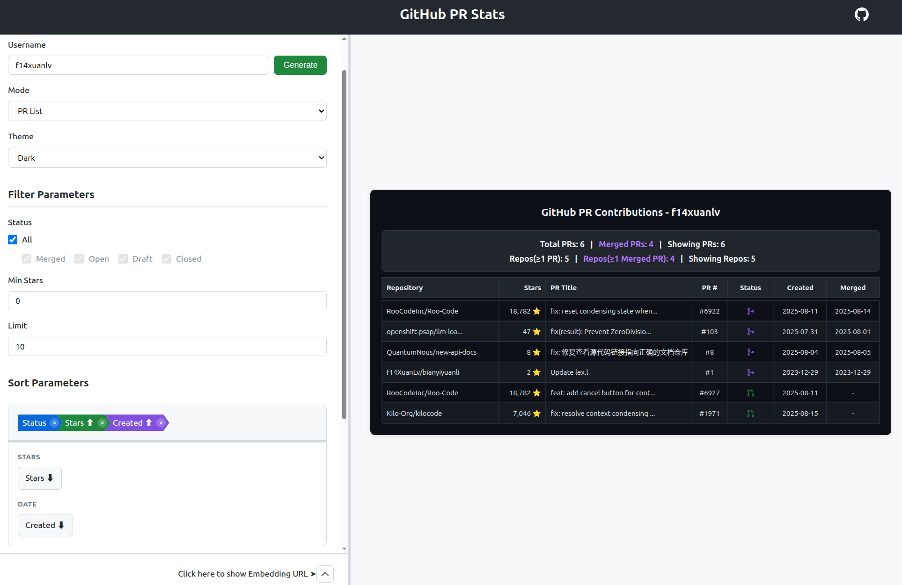

# GitHub PR Stats

<div align="center">
  
</div>

<div align="center">
  
  
  
</div>

<div align="center">
  
  
  
</div>

**🏆 展示你的开源贡献成就，让每一个被合并的PR都成为你的荣誉勋章。**

想象一下：你向 Linux kernel、OpenCV、NumPy、React 提交的PR被合并了，这些珍贵的贡献却埋没在GitHub的历史记录中。github-pr-stats 帮你把这些成就以精美的表格形式展示出来，让你的开源贡献一目了然。

## ✨ 效果预览

> **说明**: 以下演示使用通过 GitHub API 可公开获取的数据，仅用于功能演示。

### 📊 PR List 模式 - 详细PR列表


### 📈 Repository Aggregate 模式 - 仓库聚合统计

*以 Linux 创始人 Linus Torvalds 的公开PR数据作为技术演示*

### ☀️ 浅色主题


## 🚀 2分钟快速开始

### 1. 一键部署
[](https://vercel.com/new/clone?repository-url=https://github.com/f14xuanlv/github-pr-stats)

详细配置说明请查看 **[📚 文档](#📚-文档)** 中的 **[🚀 部署指南](docs/deployment_zh.md)**

### 2. 添加到个人资料
```markdown

```

### 3. 定制化展示
```markdown
# 只显示已合并的高星项目PR


# 仓库聚合，按合并率排序

```

## 🎯 为什么选择 GitHub PR Stats？

| 特性 | 优势 |
|------|------|
| **🎨 双重展示模式** | PR时间线或仓库概览 - 选择最适合你故事的展示方式 |
| **⚡ 智能缓存** | Redis加速，你的访客无需等待 |
| **🎮 可视化界面** | 无需代码 - 通过网页界面配置所有参数 |
| **🌟 质量聚焦** | 按star数筛选，突出你的高影响力贡献 |
| **📱 随处可用** | SVG输出适用于GitHub、网站、演示文稿等任何地方 |
| **🔒 隐私优先** | 你的Token安全存储在服务器端 |

## 🏆 完美适用于

- **🎓 开发者**: 在LinkedIn、简历或个人网站上展示你的开源影响力
- **🏢 企业**: 快速评估候选人真实的贡献质量和一致性  
- **📈 项目维护者**: 可视化贡献者参与度和项目健康度指标
- **🌟 开源明星**: 庆祝你对Linux、React、TensorFlow等重大项目的贡献

## 🎮 交互式配置



访问你部署的实例来使用我们的可视化参数调试器：

- **实时预览**: 调整参数时即时查看变化
- **智能默认值**: 在PR列表和仓库模式间切换时界面自动适配
- **一键复制**: 生成并复制完美适合你使用场景的URL
- **移动友好**: 在任何设备上都能配置

## 📚 文档

- **[📖 API 参考文档](docs/api-reference_zh.md)** - 完整参数指南和示例
- **[🚀 部署指南](docs/deployment_zh.md)** - 设置说明和配置  
- **[👥 用户指南](docs/user-guide_zh.md)** - 技巧、使用案例和最佳实践

## 🎨 主题和定制

从多种主题中选择并自定义各个方面：

- **🌙 深色主题** - 完美适配开发者作品集
- **☀️ 浅色主题** - 适合专业网站  
- **🎯 自定义字段** - 精确展示对你的受众重要的内容
- **📊 智能统计** - 自动突出显示你的贡献指标

## 🤝 贡献

欢迎提交 Pull Request 或 Issue。

[](https://github.com/f14XuanLv/github-pr-stats/graphs/contributors)

## ⭐ Star History

[](https://star-history.com/#f14XuanLv/github-pr-stats&Date)

## 📄 开源协议

[MIT License](https://github.com/f14XuanLv/github-pr-stats/blob/main/LICENSE) - 完全免费，欢迎贡献代码

---

**🌟 如果这个项目对你有帮助，请给个Star支持一下！**